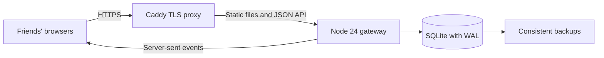

# Nexus gateway

A small, self-hosted chat app inspired by the original Battle.net lobby: metal panels, green terminal text, channel rosters, callsigns, whispers, and synthesized arrival sounds. The name, interface assets, and included audio are original. This implementation targets one trusted friend group on one server.

## Included

- Invite-based account registration; returning friends use their callsign and password.
- Persistent text channels, channel creation, and live online presence.
- Private whispers to online or offline members through Friends or by clicking a callsign.
- Reconnecting live delivery with a fresh snapshot after interruption.
- Synthesized join, whisper, and button cues; mute, sound preview, and custom join audio.
- CRT scanline preference, responsive layout, keyboard controls, and accessible dialogs.
- `/join channel`, `/w callsign message`, and `/help` commands.

## Architecture



Browsers send authenticated HTTP requests. One Node process validates and stores messages, then sends each connected member a separately authorized snapshot through Server-Sent Events. A snapshot includes the current channel's latest 200 public messages and the member's latest 200 sent/received whispers. Other members' whispers are never included. SQLite retains older history outside the visible window.

React/TypeScript is exported to static files with the Vinext/Vite scaffold. The production gateway serves those files and the API from one origin. The backend uses Node's built-in HTTP, crypto, and SQLite modules; the final container needs no installed npm dependencies. In development, Vite proxies `/api` to the local Node process.

## Run locally

Requires Node 24 and pnpm 11. Run from this directory:

```sh
pnpm install --frozen-lockfile
pnpm setup
pnpm dev:server
```

In another terminal:

```sh
pnpm dev
```

Open **http://127.0.0.1:3000**. Select **Connect**, choose a callsign and a password of at least 10 characters, and use `INVITE_CODE` from your local `.env`. Setup generates a random code without printing it and preserves an existing `.env`. Returning users leave the invite field empty.

To run the exported frontend without Vite, run `pnpm build`, set `APP_ORIGIN=http://127.0.0.1:3001` in `.env`, then run `pnpm start` and open that URL. For the two-process development setup, keep `APP_ORIGIN=http://127.0.0.1:3000`. Use the exact configured origin; `localhost` and `127.0.0.1` are distinct browser origins.

## Host with Docker and HTTPS

Use one Linux host with Docker Compose, a domain pointing to it, and inbound ports 80/443 open. Copy this directory to the host, excluding `.env`, `data`, and `node_modules`. Create `.env` using `.env.example`; generate a cryptographically random invite code of at least 16 characters, or run `pnpm setup` if Node is installed.

Set these values in `.env`:

```dotenv
DOMAIN=chat.your-domain.com
SERVER_NAME=Your Gateway
INVITE_CODE=your-long-random-invite-code
```

Then:

```sh
docker compose up -d --build
docker compose logs -f gateway
```

Caddy obtains and renews HTTPS certificates. The gateway is reachable only through Caddy, runs as a non-root user, and stores SQLite in the `chat-data` volume. Compose injects the HTTPS origin and enables secure cookies through production mode. Share the HTTPS address and invite code with your friends. Each friend creates their own account on first connection. Rotating the invite code and recreating the gateway prevents new registrations with the previous code; existing accounts continue working.

For a private VPN deployment, supply a trusted HTTPS reverse proxy and matching `APP_ORIGIN`. Keep the development server local.

## Backups and recovery

Local:

```sh
pnpm backup
```

Docker:

```sh
docker compose exec gateway node scripts/backup.mjs
docker compose cp gateway:/app/backups ./saved-backups
```

The script uses SQLite's online backup API, so snapshots include committed WAL transactions. Store copies off-host. To restore, stop the gateway, preserve its current data directory, replace the database with a backup, remove stale `nexus.sqlite-wal` and `nexus.sqlite-shm` files belonging to that stopped database, restore ownership for the container's `node` user, and restart. Never restore over a running database. Preserve the Caddy certificate volumes as well.

## Configuration

| Variable | Purpose | Local default |
| --- | --- | --- |
| `INVITE_CODE` | Secret for new registrations | Generated by setup |
| `SERVER_NAME` | Displayed gateway name | `Nexus` |
| `APP_ORIGIN` | Exact permitted browser origin | `http://127.0.0.1:3000` |
| `HOST` | Listening address | `127.0.0.1` |
| `PORT` | HTTP/API port | `3001` |
| `DATA_DIR` | Persistent SQLite directory | `./data` |
| `STATIC_DIR` | Exported frontend directory | `./dist/client` |
| `NODE_ENV` | `production` requires HTTPS and secure cookies | Development |
| `DOMAIN` | Caddy hostname in Compose | Set on deployment |

## Sound

Options includes **Test join sound**, mute, and a custom join audio URL. Put your audio at `public/sounds/join.wav`, rebuild, and set `/sounds/join.wav` in Options. HTTPS audio URLs also work. Failed audio loads fall back to the included synthesized cue. Browsers require user interaction before playing sound. Sound and scanline preferences are stored on that device.

## Operational boundaries

- Single-process: 50 registered members, 32 channels, five live tabs and ten stored sessions per member. Multiple replicas require shared presence and event delivery.
- Passwords use salted scrypt. Random session tokens are stored as hashes, held in HttpOnly/SameSite cookies, and expire after 30 days. Logout revokes the current session and its streams.
- JSON-only writes, origin checks, message/body limits, connection caps, and bounded rate-limit bookkeeping protect the small server. Failed logins are limited by callsign and connection address. Behind Caddy, the address limit is shared by the group; forwarded headers are deliberately not trusted.
- Whispers are access-controlled, not end-to-end encrypted. The server operator and database backups can read content.
- Messages remain in SQLite until the operator removes them. This text-first release has no retention scheduler, older-history browser, account recovery UI, moderation console, message editing/deletion, attachments, or voice/video.
- `/api/health` checks the database. JSON request logs include request ID, path, status, and duration, without passwords, invite codes, message bodies, or cookies.
- During an outage, the client keeps the unsent draft and shows reconnecting. Sending is acknowledged after the database write. A lost acknowledgement can cause a duplicate if the user manually retries; messages are not retried automatically.

## Validation

```sh
pnpm typecheck
pnpm lint
pnpm test
pnpm build
```

Integration tests use real HTTP/SSE clients and temporary SQLite. They cover registration/authentication, unsafe origins, channel isolation, whisper authorization, live presence/delivery, malformed input and size limits, file isolation, restart persistence, session revocation/expiration, and flood protection.

Lint covers application code and the UI primitives used by Nexus. Unused generated component-catalog files retain their upstream lint findings and are not part of this check.

The Windows build wrapper preserves failure exit codes and gives successful native build-worker cleanup one second before exiting, avoiding a Node 24/Vinext beta shutdown assertion. Linux uses normal exit behavior.

Browser interaction and Docker runtime tests were not performed in this session; Docker's daemon was unavailable. The optional WebMCP draft-staging tool is feature-detected and never sends messages; a supported validation context was unavailable. A production host and domain have not been provisioned.

## Voice chat

Voice is opt-in per channel: **Join voice**, allow microphone access, then use
**Mute / Unmute** and **Leave**. The voice bar lists participants and mute state.
Whispers do not create a private voice call: the voice bar always belongs to the
current channel. Changing channels, signing out, closing the tab, losing the
voice connection, or unplugging the microphone ends the local voice session.
Keep the browser tab open while gaming. Mute is an in-page control, not a global
keyboard shortcut. Use headphones to avoid speaker feedback.

The initial limit is eight people per channel and one voice connection per account.
Audio uses WebRTC DTLS-SRTP between participants, relayed through authenticated
coturn; the app stores neither audio nor signaling history. Relay-only ICE avoids
exposing participants' direct IP candidates to each other. HTTPS carries signaling.
This is separate from text encryption: stored text messages remain readable to the
server. Muting disables the local microphone track; incoming audio remains audible.

### Lightsail voice setup

Run from the checked-out repository on Ubuntu:

```sh
sudo bash scripts/setup-turn.sh nexus-chat.net YOUR_STATIC_PUBLIC_IPV4
sudo docker compose up -d --build
```

Open Lightsail **TCP 3478**, **UDP 3478**, and **UDP 49160–49300**. The script also
adds matching rules if UFW is active. It installs coturn, restricts private-network
relay destinations, and generates a shared secret into `.env` and
`/etc/turnserver.conf`; never commit either file. It preserves an existing
`TURN_SECRET`. The API issues authenticated users TURN credentials valid for 24 hours.
Join voice again after 24 hours if ICE needs a new allocation. Changing the secret
invalidates credentials used by existing calls; plan rotations as maintenance.

For another TURN provider set `TURN_URLS` (comma-separated TURN URLs) and
`TURN_SECRET` (coturn REST shared secret) in `.env` instead. A missing relay
configuration disables joining with an explicit error. The default deployment
supports UDP and TCP TURN on 3478, but networks that block both need a separately
configured TURN/TLS endpoint, typically on 443. Caddy already owns this server's 443.

Check `sudo systemctl status coturn` and `sudo journalctl -u coturn` to diagnose relay
issues. Voice consumes Lightsail bandwidth and a mesh uses one stream per pair;
consider an SFU before raising the eight-person limit. Server restarts end active
voice sessions; users must rejoin. Membership leases remove unreachable clients
within approximately three minutes. No database migration is required.

Verification before relying on a game session: join from two accounts on different
networks, confirm two-way audio, mute/unmute, then test leaving, closing a tab and
switching channels. If the browser blocks playback, click **Enable incoming audio**.
Automated tests cover voice authorization, cross-channel signal rejection, roster,
mute, cleanup and microphone lifecycle; they do not replace a real audio test.

Voice controls also include **Deafen / Undeafen**, which silences incoming voices locally, including newly joined participants. It does not mute your microphone; use **Mute** separately for private conversations. Leaving voice resets Deafen. The right-hand member list marks voice participants and microphone mute status.
